# 浙江大学Latex幻灯片模板

## News

**2025.12.12** 

- feature: 添加vscode配置文件

**2025.7.10** 

- fix: 修改了右上角颜色不匹配问题；
- feature: 增加Makefile；增加references.bib；增加并排图片显示示例；增加代码示例；
- docs: 更新了README，增加各个平台使用方法；增加部分zju_beamer.sty的注释；增加了字体配置的说明；
- test: 在Mac、Ubuntu、Win11、Overleaf等平台上进行了测试

**2023.10.17** 修改了一些细节，并在CC98宣传！有任何问题和建议欢迎在Issues中提出！

**2023.8.23** 将模板上传到了Overleaf，欢迎使用。Link：[Template](https://www.overleaf.com/latex/templates/zhe-jiang-da-xue-beamer-mo-ban-zju-beamer-template/jhtfvynrcbrg)

**2023.8.22** 首次提交了模板

## Quick Start

### Windows
1. 下载并安装 TeXLive（安装过程略）
2. 下载本模板文件(或者在Release中下载压缩包)

```shell
git clone https://github.com/qychen2001/ZJU-Beamer-Template.git
```

3. 在命令行中使用`XeLaTeX`编译

```shell
xelatex ZJU_BeamerTemplate.tex
bibtex ZJU_BeamerTemplate
xelatex ZJU_BeamerTemplate.tex
xelatex ZJU_BeamerTemplate.tex
```

4. 或者可以在VsCode中使用`LaTeX Workshop`插件编译，选择`XeLaTeX`编译器。

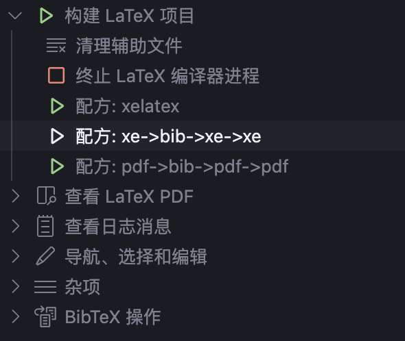

### Linux/Mac
1. 下载并安装 TeXLive（安装过程略）
2. 下载本模板文件(或者在Release中下载压缩包)

```shell
git clone https://github.com/qychen2001/ZJU-Beamer-Template.git
```

3. 编写 ```.tex``` 文件；
4. 使用`make`编译

```shell
make # 编译
```

```shell
make init   # 删除所有辅助文件以及图片
make clean  # 删除辅助文件
make help   # 显示帮助信息
```

5. 或者在命令行中使用`XeLaTeX`编译，或者使用`LaTeX Workshop`插件编译，选择`XeLaTeX`编译器。（详见上一部分[Windows](#windows)）

### Overleaf

方法1: 使用[模版](https://www.overleaf.com/latex/templates/zhe-jiang-da-xue-beamer-mo-ban-zju-beamer-template/jhtfvynrcbrg)创建


方法2: 

- 下载压缩包文件，在Overleaf中新建项目，选择“Upload Project”，上传压缩包文件。
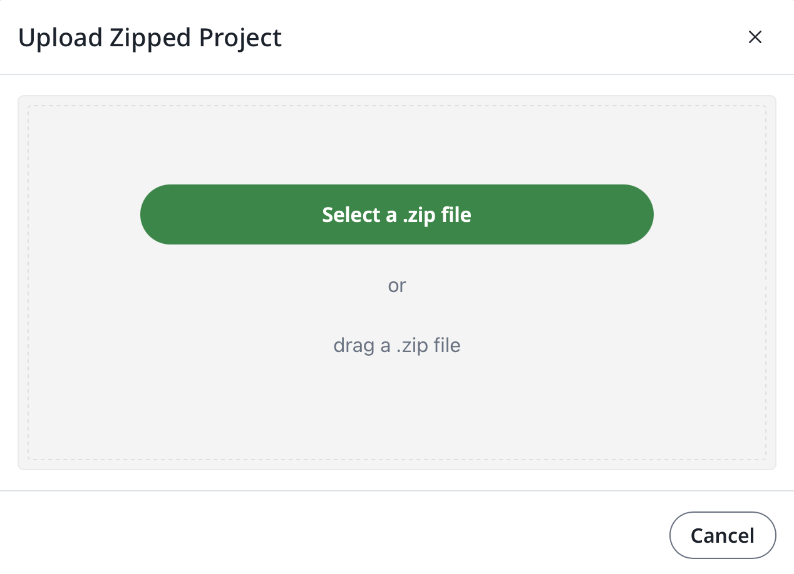
- Overleaf 默认使用pdfLaTeX编译，请在页面左上角的`Menu`中编译器选择`XeLaTeX`
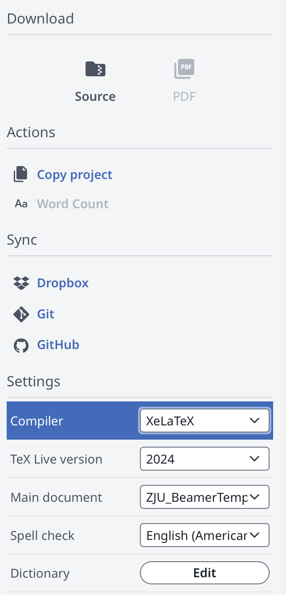
- 在Overleaf中点击`Compile`，即可预览PDF。


## Tested Platforms
- [x] Mac + TeX Live 2025
- [x] Ubuntu 22.04 + TeXLive 2025
- [x] Win11 + TeXLive 2024
- [x] Overleaf(TexLive 2024)

有关字体问题详见[LaTeX 中文字体配置基础指南 - 知乎](https://zhuanlan.zhihu.com/p/538459335)，这里使用ctex默认配置。如需使用其他字体，请参考该指南自行修改。


## Examples

你可以在 [ZJU_BeamerTemplate.pdf](./ZJU_BeamerTemplate.pdf) 查看编译后的幻灯片效果。

如果你在本地环境，可以直接用PDF阅读器打开 `ZJU_BeamerTemplate.pdf` 文件进行预览。

Overleaf 用户可直接在 Overleaf 项目中点击“Recompile”后在线预览PDF。

示例截图：


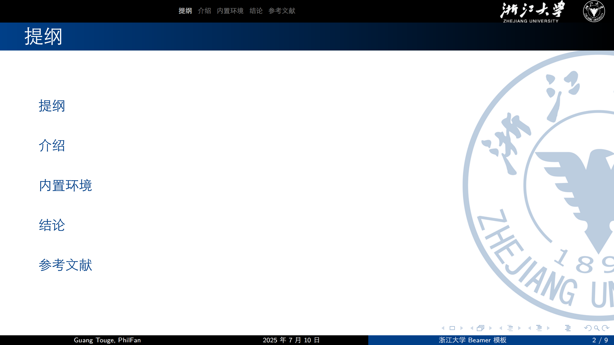
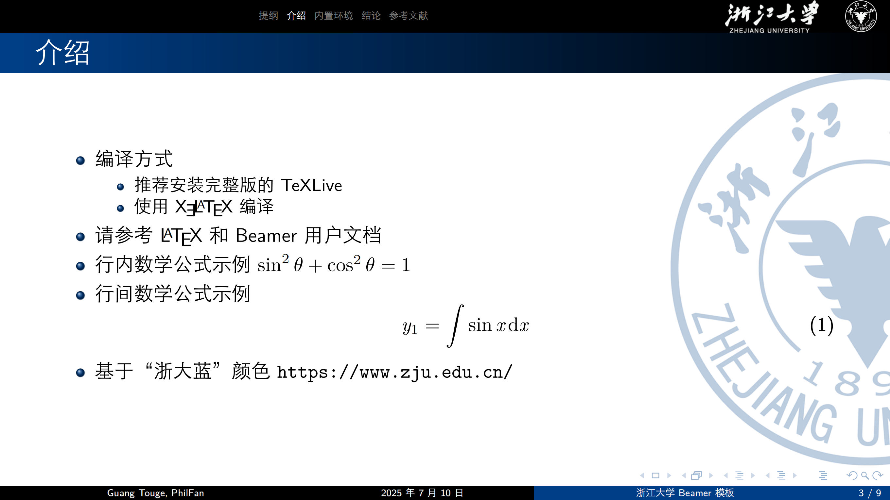
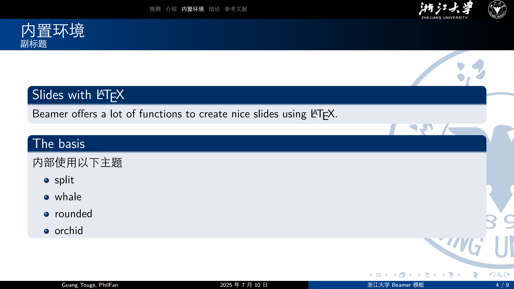
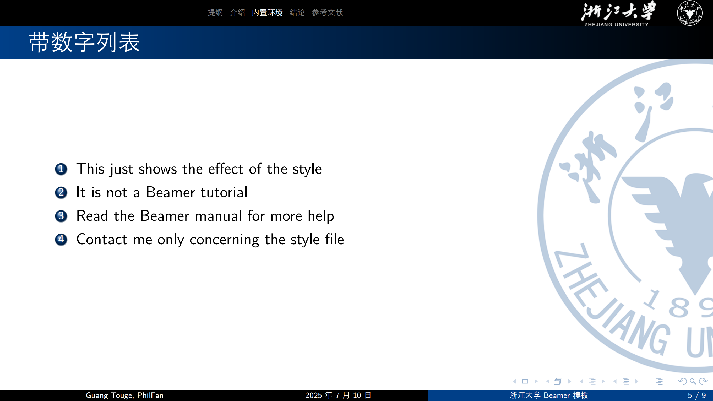
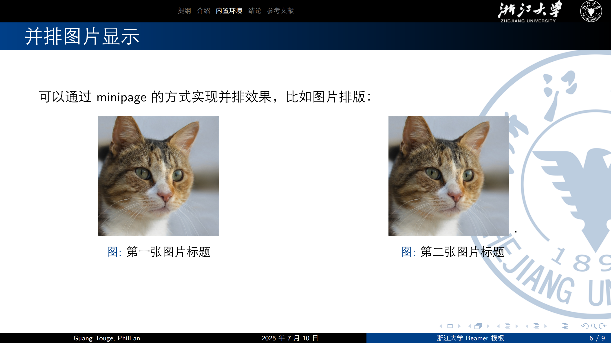
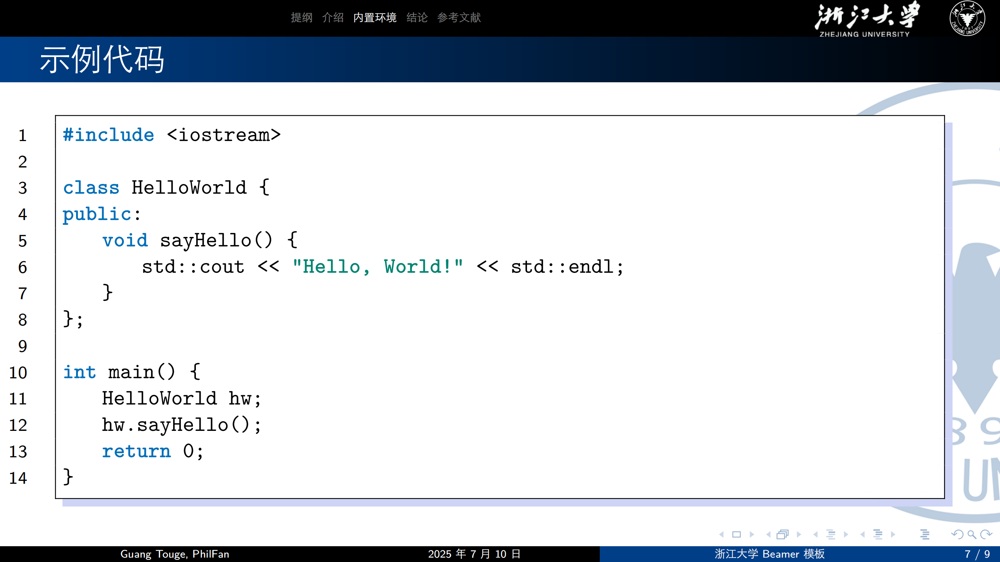
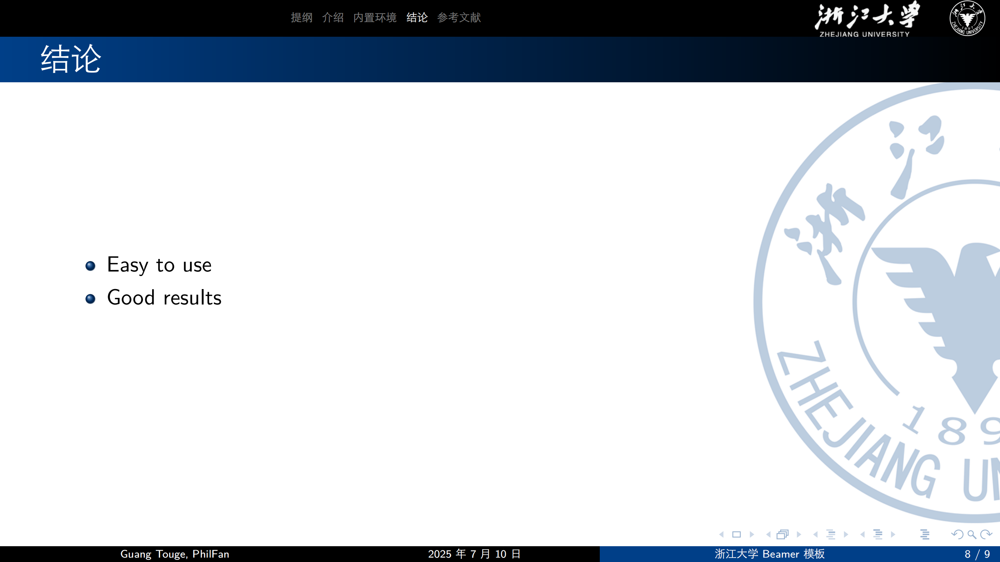
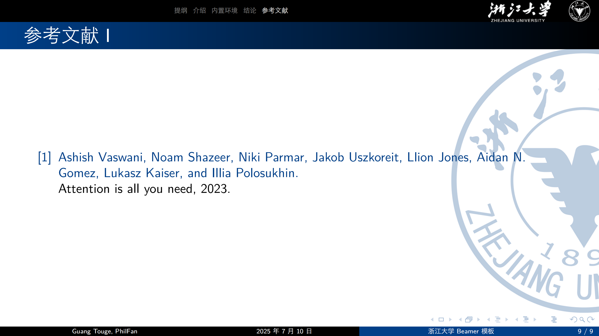


## Acknowledgments

此模板大量参考了[华中师范大学beamer](https://github.com/K-JW/CCNU_BeamerTemplate)模板，在此向原作者表示感谢。
